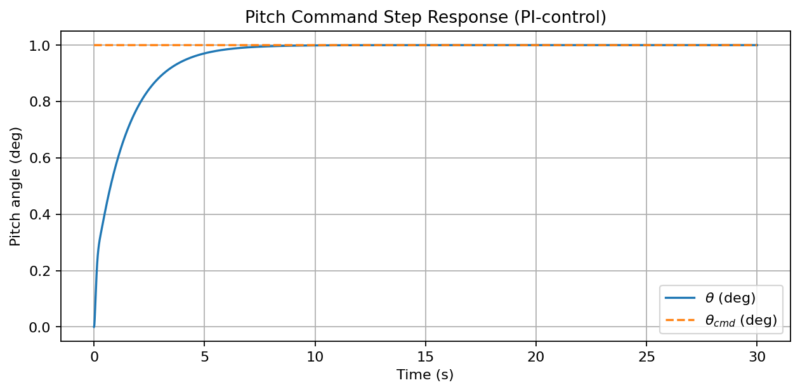
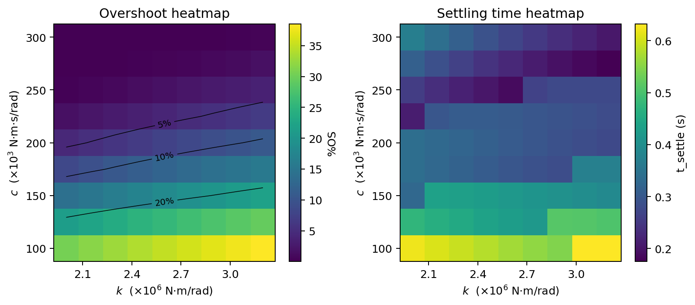

# Aircraft Pitch Stability – MBSE Simulation in Python

This project models aircraft pitch dynamics as a second-order rotational plant and verifies closed-loop stability/performance using time-domain metrics. It includes a baseline step simulation, a 2D parameter sweep (stiffness/damping), and a Monte Carlo robustness study.

**Skills demonstrated:** control systems, Python simulation, requirements-style verification, numerical modeling, parameter studies  
**Tools:** Python, NumPy, SciPy, Matplotlib

---

## System Model

### Plant (pitch axis)
The pitch axis is modeled as a 2nd-order rotational system:

\[
I_{yy}\,\ddot{\theta} + c\,\dot{\theta} + k\,\theta = K_{act}\,u(t)
\]

- \(\theta(t)\): pitch angle (rad)  
- \(I_{yy}\): pitch inertia (kg·m²)  
- \(c\): damping (N·m·s/rad)  
- \(k\): stiffness (N·m/rad)  
- \(K_{act}\): actuator/control effectiveness  
- \(u(t)\): control input

### Controller (PI)
Tracking a commanded pitch step \(\theta_{cmd}\) using a PI controller:

\[
e(t) = \theta_{cmd}(t) - \theta(t)
\]
\[
u(t) = K_p\,e(t) + K_i \int_0^t e(\tau)\,d\tau
\]

---

## Verification Metrics (computed in `specs.py`)

Each run computes:

- **Steady-state value** \(\theta_{ss}\) (mean of last 10% of samples)
- **Percent overshoot** (%OS)
- **Settling time** \(t_{settle}\) to ±2% band (configurable via `band` in `settling_time`)
- **Rise time** \(t_{rise}\) from 10%→90%
- **DC gain consistency check** (theory vs measured), reported as `dc_gain_error`

---

## Current Tuned Configuration (PI)

Tuned gains used for the presented results:

- \(K_p = 2.0\)
- \(K_i = 6.0\)
- Simulation horizon \(T = 30\) s

Example closed-loop step metrics (from `python specs.py`):

- \(\theta_{ss} \approx 1.000^\circ\)
- %OS \(\approx 0.00\%\)
- \(t_{settle}(\pm 2\%) \approx 5.567\) s
- \(t_{rise}(10\%\to 90\%) \approx 3.090\) s
- DC gain error \(\approx 0.00\%\)

---

## Features

- Baseline closed-loop step simulation + plotting
- Time-domain performance metric extraction (`specs.py`)
- 2D parameter sweep over \((k, c)\) with heatmaps
- Monte Carlo robustness evaluation under parameter uncertainty
- Clean, scriptable workflow for technical presentations

---

## Repository Structure


```
aircraft-pitch-project/
├── common.py # Helper functions
├── simulate.py # Plant + PI control simulation
├── sweep.py # 2D sweep over (k, c) + heatmaps
├── monte_carlo.py # Robustness study (randomized parameters)
├── specs.py # Metric computation + reporting
├── requirements.txt # Dependencies
├── figs/ # Saved figures
│ ├── step_closed.png
│ ├── tuning_heatmaps.png
│ ├── heatmap_overshoot.png
│ ├── heatmap_settling.png
│ └── step_response.png
└── README.md

```


---

## Results

### Step Response (Closed Loop, PI Control)

The tuned **PI** controller tracks a 1° pitch command with near-zero overshoot and improved settling time.

Default run parameters (from `simulate.py`):
- `k = 2.5e6` N·m/rad
- `c = 2.4e5` N·m·s/rad
- `K_act = 5.0e5`
- `Kp = 2.0`, `Ki = 6.0`
- `theta_cmd_deg = 1.0`
- `T = 30.0 s`, `dt = 0.001 s`

<p align="center">
  
</p>

---

### Parameter Sensitivity – Overshoot and Settling Time (k vs c)

A 2D sweep over stiffness `k` and damping `c` shows how performance metrics change across the design space, using the same metric extraction in `specs.py` at each grid point.

<p align="center">
  
</p>

Key trend (from the sweep):
- In this tested window, **settling time is driven primarily by stiffness `k`** (higher `k` → faster settling).
- Overshoot remains **near zero** across most of the region with the current PI tuning.

---

### Robustness – Monte Carlo

A Monte Carlo robustness study was run with **N = 500** trials, applying **±15% uniform uncertainty** to key plant parameters (`Iyy`, `k`, `c`, `K_act`) while holding the controller gains fixed within each configuration. Each trial was checked against requirements: **%OS ≤ 30%**, **t_settle ≤ 6.5 s**, and **|dc_gain_error| ≤ 0.10**.

This compares a **Baseline** nominal configuration against an **Alternate** nominal configuration (different `k`/`c` and gains) to show how robustness can shift across setups under the same uncertainty model.

```text
Baseline:  pass-rate = 100.0%  OS mean±std = 0.00±0.00%  t_settle mean±std = 4.047±0.425 s
Alternate: pass-rate = 82.6%   OS mean±std = 0.00±0.00%  t_settle mean±std = 6.010±0.496 s


```

Most failures in the Alternate case are driven by settling time (t_settle) exceeding the t_settle <= 6.5 s requirement under parameter uncertainty, rather than overshoot or DC gain error.


---

## Setup + Run

```bash
python3 -m venv .venv
source .venv/bin/activate
pip install -r requirements.txt

python specs.py
python sweep.py
python monte_carlo.py

```
