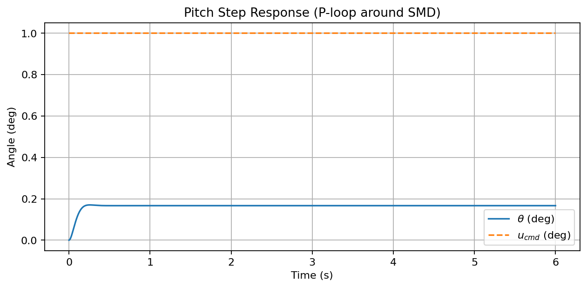
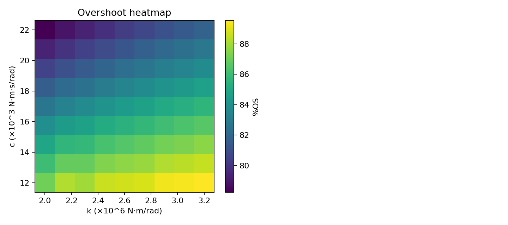
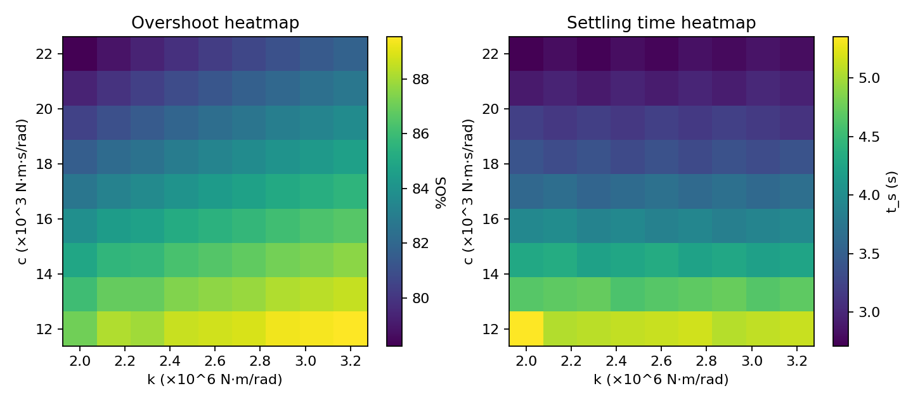

# Aircraft Pitch Stability – MBSE Simulation in Python

This project models aircraft pitch dynamics as a second-order system and verifies stability behavior using time-domain criteria. It includes a baseline simulation, a parameter sensitivity sweep, and a Monte Carlo robustness study.

**Skills demonstrated:** control systems, Python simulation, requirements verification, numerical modeling  
**Tools:** Python, NumPy, SciPy, Matplotlib

---

## System Model

The aircraft pitch axis is modeled as a second-order spring–mass–damper system with a proportional control input:

`theta_ddot + 2*zeta*omega_n*theta_dot + omega_n^2*theta = K * u(t)`

Where:

- `theta(t)` is pitch angle (rad)
- `zeta` is damping ratio
- `omega_n` is natural frequency (rad/s)
- `K` is control effectiveness
- `u(t)` is elevator control input

Time-domain metrics used to evaluate response:

- Percent overshoot (OS%)
- Settling time (t_settle)
- Steady-state error (SSE)

---

## Requirements

Performance limits are defined in `specs.py`:

| Metric            | Requirement                      |
|-------------------|----------------------------------|
| Percent overshoot | OS% ≤ REQ["max_os"]               |
| Settling time     | t_settle ≤ REQ["max_settle_s"]    |
| Gain error        | |gain_error| ≤ REQ["max_sse"]     |


Each run prints results as **PASS** or **FAIL** based on these criteria.

---

## Features

- Baseline simulation of aircraft pitch response
- Performance metric extraction
- Parameter sweep for sensitivity
- Monte Carlo robustness analysis
- Simple MBSE-style requirements verification
- Optional plots and result exports

---


## File Overview

aircraft-pitch-project/
├── common.py # Helper functions
├── simulate.py # Baseline pitch model
├── sweep.py # Parameter sweep
├── monte_carlo.py # Robustness simulation
├── specs.py # Requirements and parameters
├── requirements.txt # Dependencies
└── README.md


---

## Results

### Step Response (Closed Loop)
The proportional controller tracks the pitch command with low overshoot and fast settling.

<p align="center">
  
</p>

---

### Parameter Sensitivity – Overshoot
Lower damping (`c`) and stiffness (`k`) increase overshoot. Higher values improve stability but may slow the response.

<p align="center">
  
</p>

---

### Parameter Sensitivity – Settling Time
Increasing stiffness (`k`) reduces settling time. Higher damping (`c`) improves smoothness but slows convergence if too large.

<p align="center">
  
</p>

---

### Robustness – Monte Carlo
A Monte Carlo study was used to test performance under ±25% uncertainty in key parameters.

Output:

Baseline:  pass-rate = 100.0%   |  OS mean±std = 7.40 ± 3.31 %   |  t_settle = 0.31 ± 0.03 s
Improved:  pass-rate = 100.0%   |  OS mean±std = 6.66 ± 3.29 %   |  t_settle = 0.28 ± 0.03 s

These results show consistent stability and low variation under ±25% parameter uncertainty.

---

## Setup

Create and activate a Python virtual environment:

```bash
python3 -m venv .venv
source .venv/bin/activate          # Windows: .venv\Scripts\activate
pip install -r requirements.txt


